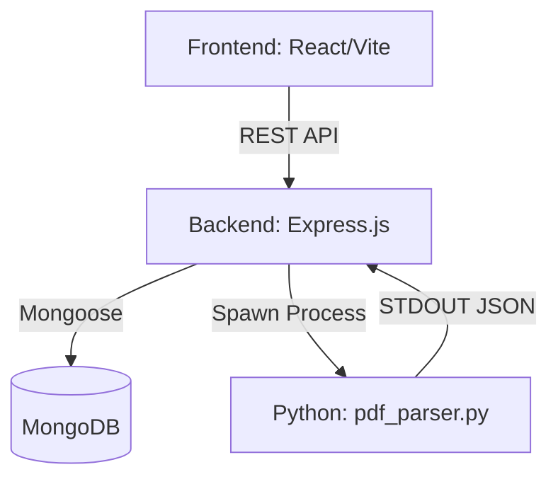
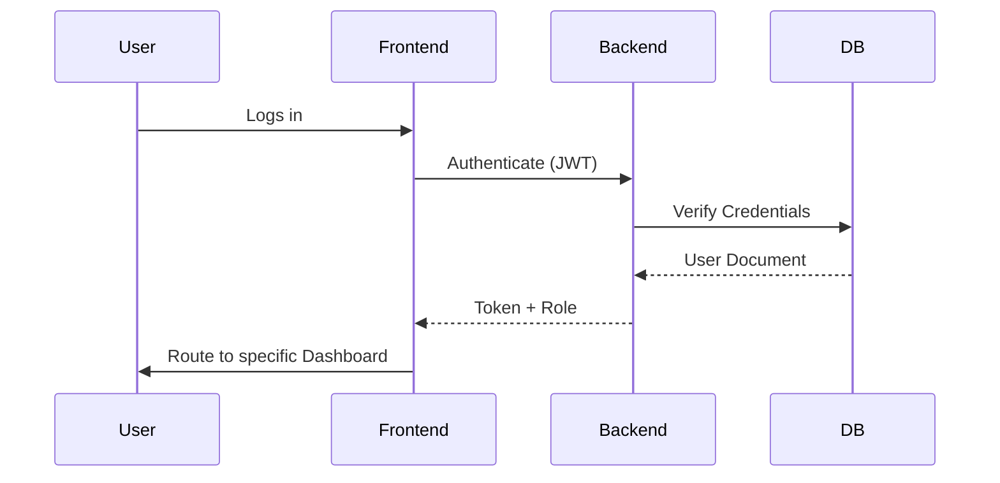
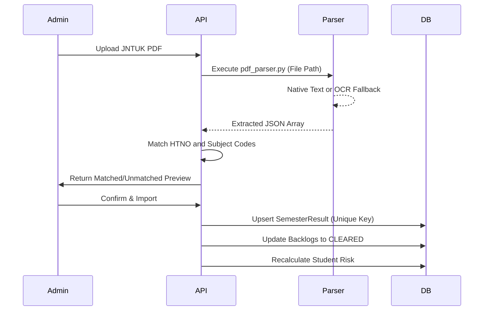
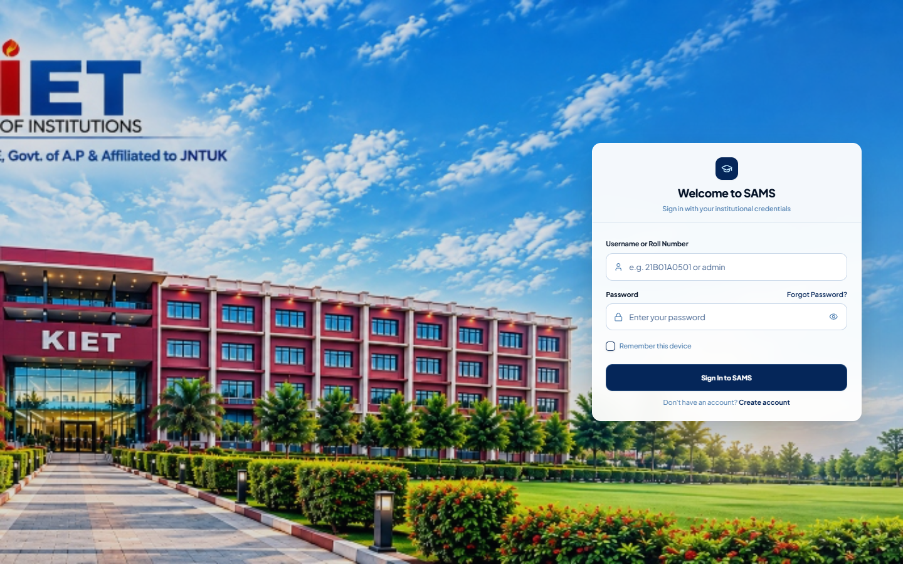
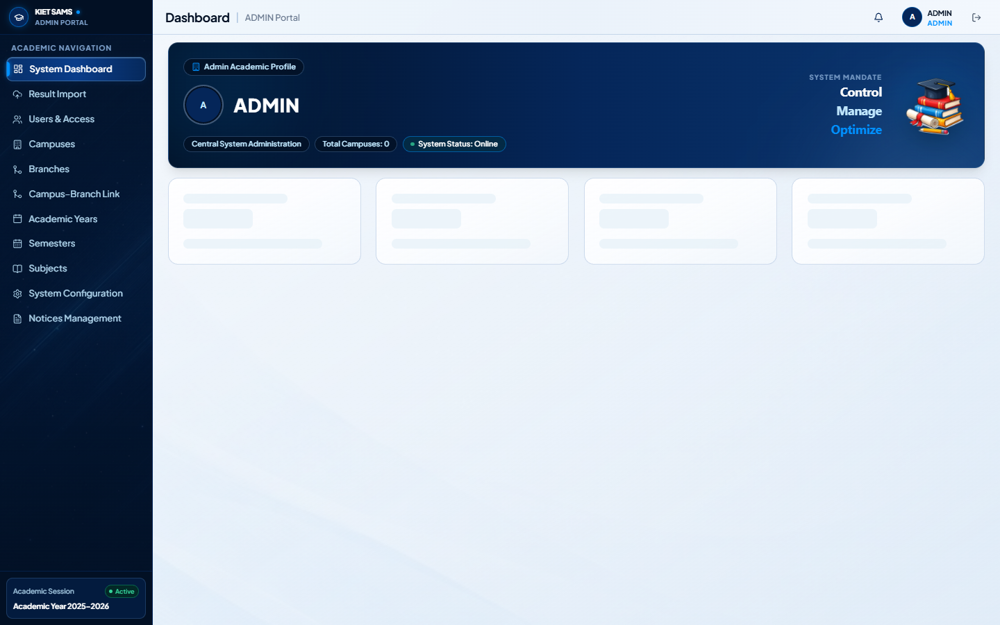
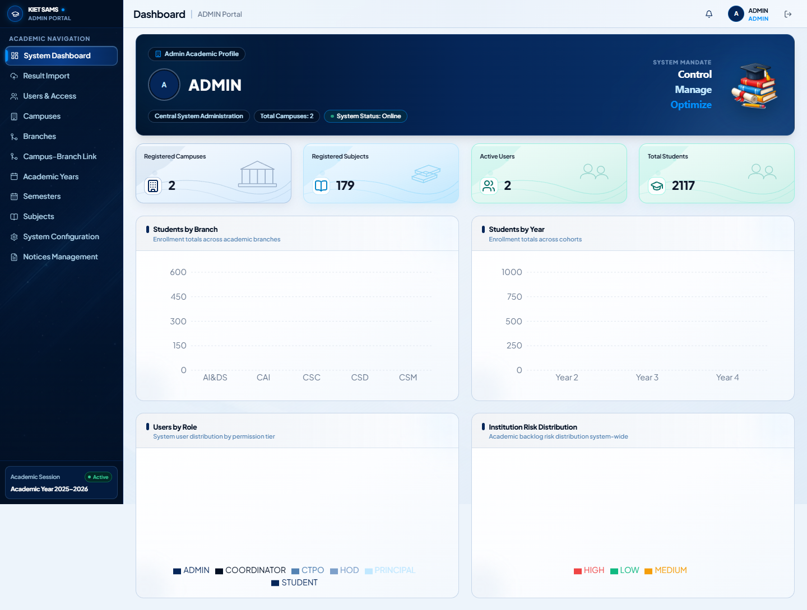
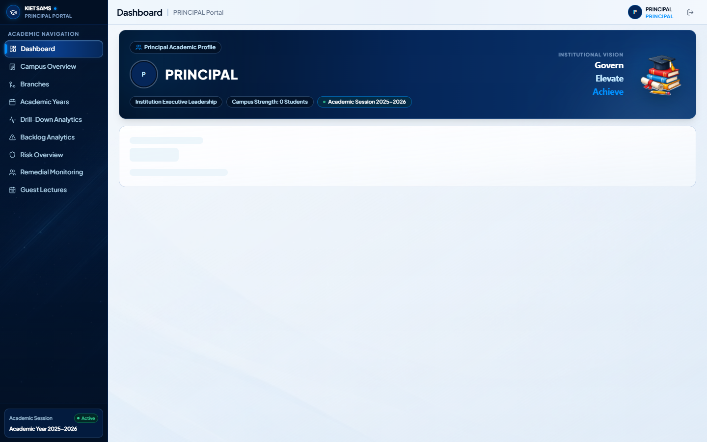
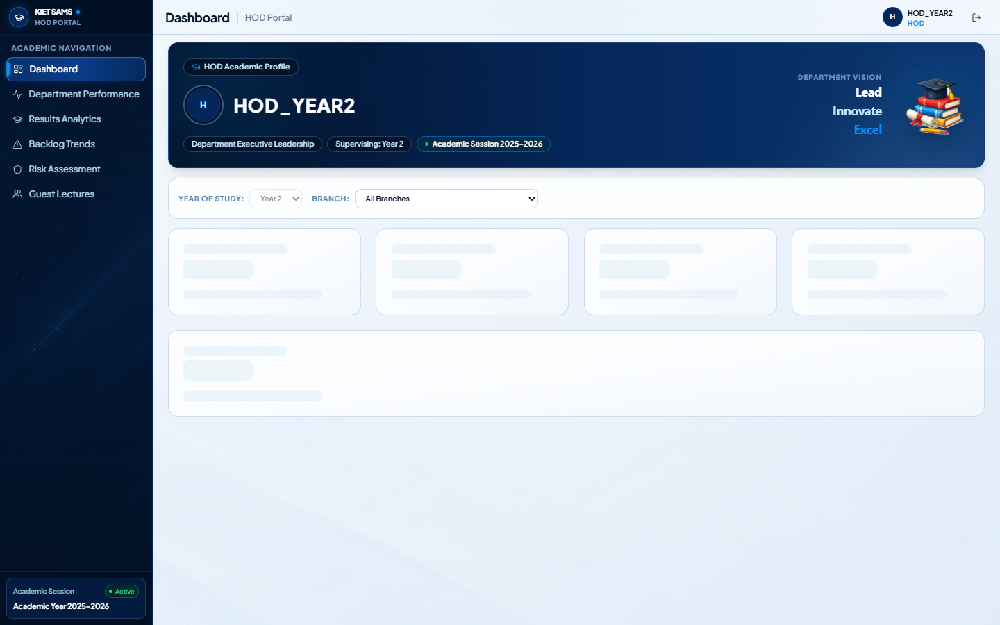
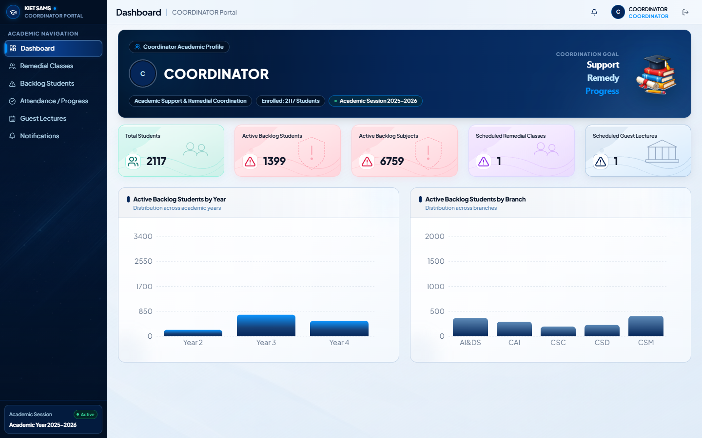

# Academic Engagement, Student Risk & Academic Support Management System

## 1. Project Overview
This project is a comprehensive **Academic Engagement and Student Risk Management System**. Designed specifically for engineering colleges, it enables seamless tracking of student academic performance, automated backlog and risk calculations, and proactive academic support workflows. 

## 2. Problem Statement
Tracking student performance across multiple semesters and identifying "at-risk" students (e.g., those with mounting backlogs or poor CGPAs) is historically a manual, error-prone process. Academic support interventions like Remedial Classes or Guest Lectures often lack a centralized tracking mechanism, leading to miscommunication between Coordinators, HODs, and the Principal.

## 3. Objectives
- Automatically calculate SGPA, CGPA, and track cumulative backlogs from uploaded JNTUK Result PDFs.
- Instantly identify "At-Risk" students (Low, Medium, High, At-Risk thresholds).
- Provide real-time analytics to the Principal and HODs.
- Digitize the scheduling and tracking of Guest Lectures and Remedial Classes.
- Distribute role-based notifications across the institution.

## 4. Main Features
- **Role-Based Dashboards:** Unique, secure interfaces for Admin, Principal, HOD, Coordinator, CTPO, and Student.
- **JNTUK Result PDF Import:** Hybrid native-text and OCR parsing of official JNTUK Result PDFs.
- **Automated SGPA/CGPA Calculation:** JNTUK-style cumulative grade calculations.
- **Risk Analysis:** Real-time risk categorization based on active backlog counts.
- **Guest Lecture & Remedial Class Workflows:** Automated scheduling, tracking, and role-based completion alerts.
- **Principal Drill-Down:** Deep-dive analytics filtering down from Campus -> Branch -> Year -> Semester -> Student.
- **Avatar Management:** GridFS-backed profile picture uploads for all roles.

## 5. User Roles & Responsibilities
- **Admin:** Master data management (Branches, Campuses, Users, Subjects), and JNTUK Result PDF Importing.
- **Principal:** Institution-wide analytics, drill-down metrics, and oversight of all branches/years.
- **HOD:** Department-level analytics, oversight of branch performance, and backlog risk management.
- **Coordinator:** Scheduling and managing Guest Lectures and Remedial Classes.
- **CTPO / Class Teacher:** Managing section-level notices and tracking specific student cohorts.
- **Student:** Viewing personal semester results, cumulative SGPA/CGPA, backlogs, and notifications.

## 6. Technology Stack
**Frontend:**
- React (JavaScript / JSX)
- Vite
- React Router
- Tailwind CSS
- shadcn/ui & Radix UI (Component Library)
- Recharts (Analytics)

**Backend:**
- Node.js & Express.js (JavaScript)
- MongoDB & Mongoose
- JSON Web Tokens (JWT) & bcrypt (Authentication)
- Multer & GridFS (File and Avatar Storage)

**Result Processor (Python):**
- Python 3
- `pdfplumber` (Native text extraction)
- `PyMuPDF` (PDF image rasterization)
- `pytesseract` & `Pillow` (OCR fallback)
- Tesseract OCR engine

## 7. System Architecture


## 8. Application Workflow


## 9. Result PDF Import Workflow


## 10. Local Setup & Testing

### Environment Configuration
1. Clone the repository.
2. Copy `backend/.env.example` to `backend/.env` and update the `MONGODB_URI`.
3. Create `frontend/.env` pointing to the backend API.

### MongoDB Requirements
- A running MongoDB instance (local or Atlas).
- Ensure the database is seeded using `node backend/src/setup_final_accounts.js`.

### Tesseract OCR Requirement
- To process image-based result PDFs, you **must** install Tesseract OCR on the Windows host machine (e.g. via UB-Mannheim installer) and ensure `tesseract.exe` is in `C:\Program Files\Tesseract-OCR` or in the system PATH. 
- Native text PDFs will process without Tesseract.

### Backend Setup
```bash
cd backend
npm install
npm run dev
npm test -- --runInBand
```

### Frontend Setup
```bash
cd frontend
npm install
npm run dev
npm run build
```

### Result Processor Setup
```bash
cd result-processor
pip install -r requirements.txt
```

## 11. Known Limitations
- OCR fallback accuracy depends heavily on the scan quality of the PDF.
- PDF Parser relies on standard JNTUK column order; severe deviations in university PDFs may require regex updates. (Verified via local OCR dependency detection, awaits real text-based JNTUK PDF for live production verification).

## 12. Screenshots






