# Academic Engagement, Student Risk & Academic Support Management System

## 1. Project Overview
The Student Academic Management System is a comprehensive platform designed to streamline and centralize academic administration. It provides role-based access for students, coordinators, department heads, and administrators to effectively monitor student performance, track attendance, identify at-risk students, and coordinate academic support programs such as remedial classes and guest lectures. By consolidating fragmented academic data, the system empowers institutions to proactively support student success through actionable analytics and event-driven notifications.

## 2. Problem Statement
Educational institutions often struggle with fragmented academic data spread across disparate systems, making it difficult to maintain a holistic view of student performance. Key challenges include:
- Fragmented and delayed result management.
- Inefficient monitoring of active backlogs and attendance.
- Delayed identification of at-risk students who need immediate intervention.
- Poor communication regarding remedial support and guest lectures.
- Lack of role-specific insights for HODs, Coordinators, and CTPOs to administer academic protocols effectively.

## 3. Objectives
- Consolidate academic performance metrics into a single source of truth.
- Enable targeted academic support through Remedial Classes and Guest Lectures.
- Implement a rigid Role-Based Access Control (RBAC) to enforce data privacy and security.
- Automate result extraction and importation pipelines.
- Empower educators with real-time risk assessment dashboards.

## 4. Key Features
- **Centralized Dashboard**: Role-specific views focusing on relevant KPIs and tasks.
- **Risk Assessment Module**: Proactively flags students based on performance metrics.
- **Result Processing**: Automated PDF ingestion and transformation via a dedicated Python service.
- **Backlog Management**: Clear tracking of active vs. cleared backlogs.
- **Academic Support Scheduling**: Built-in workflows for organizing Guest Lectures and Remedial Classes.
- **Event-Driven Notifications**: Role-aware bell notifications ensuring prompt action.
- **Secure File Storage**: GridFS integration for avatar and profile management.

## 5. Technology Stack
| Layer | Technology |
|---|---|
| Frontend Framework | React |
| Frontend Language | JavaScript / JSX |
| Build Tool | Vite |
| Styling | Tailwind CSS |
| UI Components | shadcn/ui / Radix UI |
| Routing | React Router |
| Charts & Visualization | Recharts |
| Backend Runtime | Node.js |
| API Framework | Express.js |
| Backend Language | JavaScript |
| Database | MongoDB |
| ODM | Mongoose |
| Media Storage | MongoDB GridFS (Avatars) |
| Authentication | JWT |
| Password Security | bcrypt |
| Data Storage & Upload | Multer |
| Result Processing | Python |

## 6. System Architecture
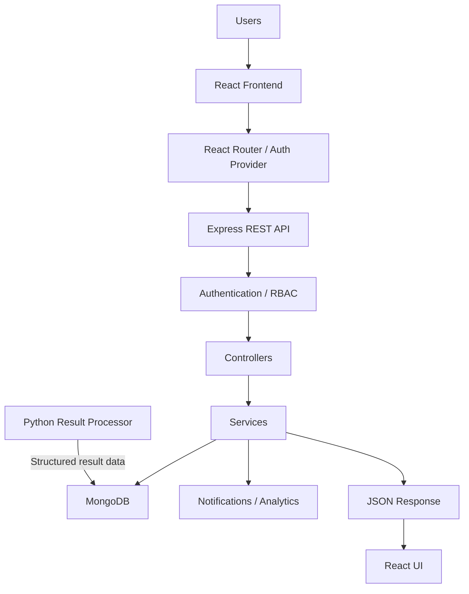

## 7. Complete System Workflow
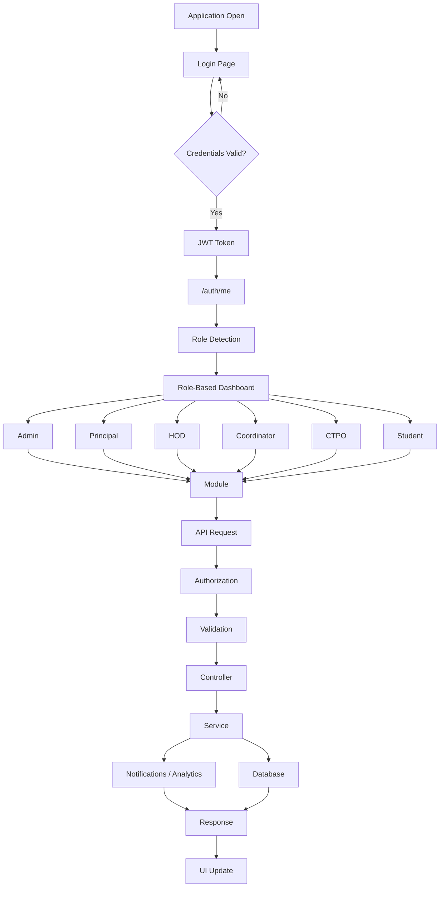

## 8. Authentication & RBAC
Authentication is facilitated by JWT with password verification powered by bcrypt.
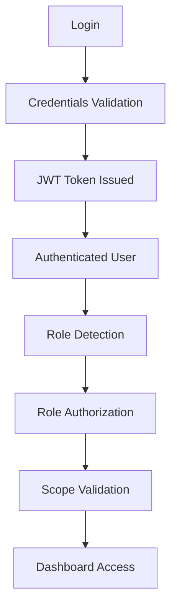
*Security Note: The system utilizes role-based access control (RBAC) paired with scope validation to ensure strict student identity protection and precise departmental data siloing.*

## 9. Roles & Permissions
The application serves exactly six roles, ensuring structured data access:
1. **Admin**: System-level scope. Full access to imports, configurations, master data, and user management.
2. **Principal**: Campus-level scope. Aggregated analytics, performance tracking, and overarching administrative insights.
3. **HOD**: Year-level scope. Departmental analytics, oversight of results, backlogs, and academic support activities.
4. **Coordinator**: Academic support scope. Manages execution of remedial classes, guest lectures, and student attendance tracking.
5. **CTPO (Class Teacher)**: Branch/Class-level scope. Assesses direct student risks, performance, and localized class analytics.
6. **Student**: Individual scope. Strictly isolated access to their personal performance, backlogs, and relevant notifications.

## 10. Role-by-Role Workflows

### Six-Role Routing Workflow
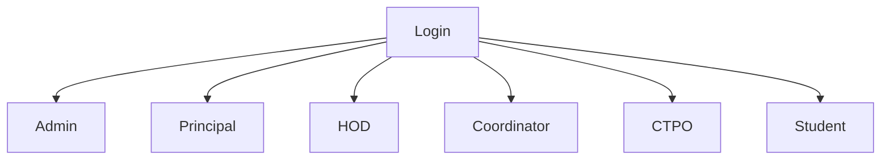

### Role Workflow & Responsibilities
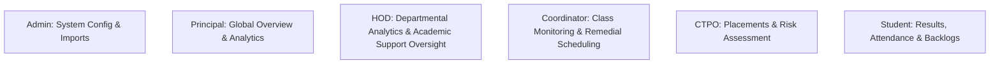

### HOD Workflow
The HOD workflow is strictly constrained to the following menu. Notifications are inherently integrated into the Guest Lectures workflows and the generic notification bell is intentionally hidden.
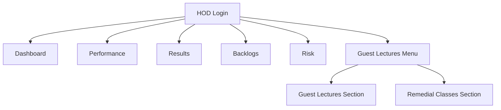

### Student Academic Workflow
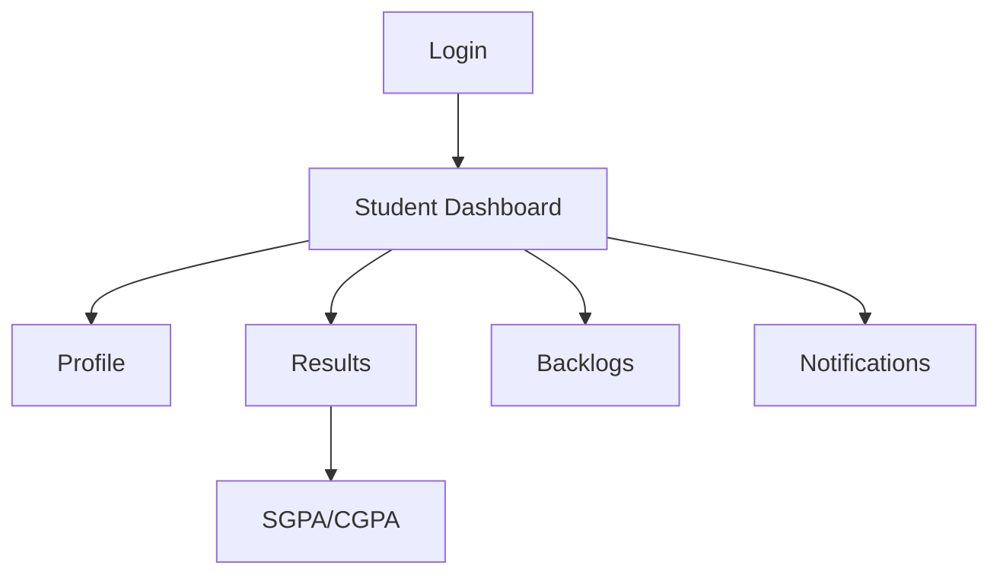

## 11. Academic Data Flow
Academic calculations are derived directly from validated subject credits and grade points.
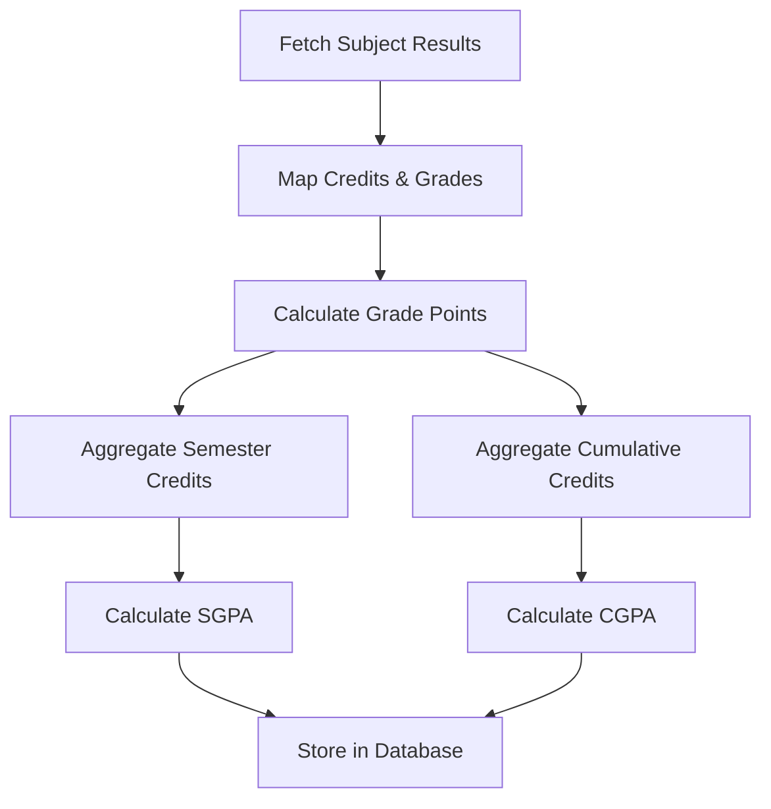

## 12. Results / SGPA / CGPA
Results are displayed historically per semester. SGPA is aggregated individually, whereas CGPA provides the cumulative metric based strictly on database-derived facts.

## 13. Backlogs
The system automatically detects, isolates, and tracks student backlogs, allowing Coordinators and CTPOs to effectively organize subsequent support without conflating them with regular curriculum performance.

## 14. Guest Lectures & 15. Remedial Classes
Academic support forms a critical pillar. The Coordinator schedules these events.
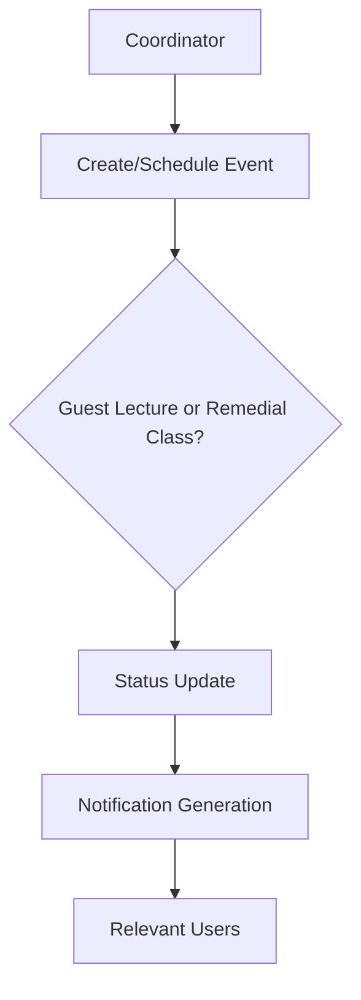

## 16. Notifications
The notification subsystem intelligently routes alerts based on roles:
- **Student**: Access via topbar bell, navigates to `/student/notifications`.
- **Coordinator**: Access via topbar bell, navigates to `/coordinator/notifications`.
- **CTPO (Class Teacher)**: Access via topbar bell, navigates precisely to `/ctpo/notices`.
- **Admin**: Access via topbar bell, navigates to `/admin/notices`.
- **Principal**: Handled natively based on scope logic.
- **HOD**: The bell is explicitly hidden; alerts strictly trigger through relevant component sub-menus like Guest Lectures.

## 17. Analytics
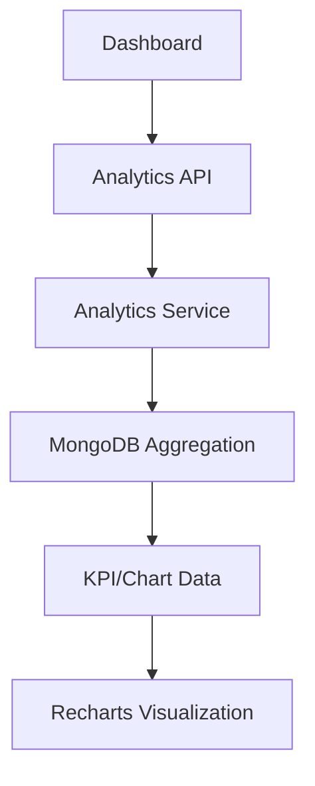

## 18. Profile & Avatar
Profile components natively integrate with MongoDB GridFS for secure rendering.
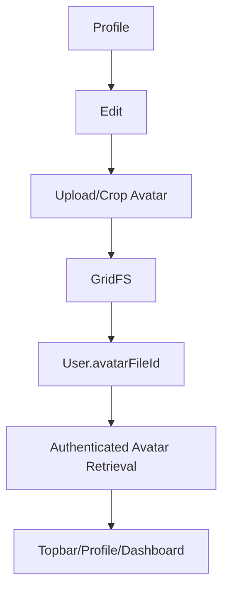

## 19. Result Import
Admins can batch import data. The Result Import UI securely fetches valid academic semesters, deduplicating records so only the standard mapping (`1-1`, `1-2`, `2-1`, `2-2`, `3-1`, `3-2`, `4-1`) is presented to the Administrator.

## 20. API Architecture
Express.js routes employ unified middleware protecting endpoints by both authentication (`token validation`) and precise authorization (`RBAC/Scope bounds`). Service layers extract business logic to maintain high modularity.

## 21. Database Architecture
MongoDB is deployed using Mongoose with carefully isolated models (`User`, `Student`, `SemesterResult`, `Event`, `Notification`, etc.). GridFS is utilized explicitly for BLOB retention (e.g., Avatars).

## 22. Frontend Architecture
The frontend leverages a purely JavaScript Vite/React stack. Tailored shadcn/ui components ensure highly aesthetic layouts, governed by React Router DOM for role-guarded access paths.

## 23. Backend Architecture
Node.js processes asynchronous requests, relying on JavaScript implementations for scalable event handling, aggregation pipelines, and robust JWT lifecycles. 

## 24. Project Structure
```text
project/
├── backend/               # Node.js Express backend and API logic
│   ├── src/               # Application source code
│   ├── uploads/           # Ephemeral storage buffers
│   └── package.json       # Backend configurations
├── frontend/              # Vite/React JavaScript application
│   ├── src/               # React components, contexts, and modules
│   └── package.json       # Frontend configurations
├── result-processor/      # Python utility for PDF parsing and extraction
├── source-data/           # Baseline seed and reference data
├── reference/             # Original institutional documentation
├── .env.example
├── .gitignore
└── README.md
```

## 25. Local Setup
1. **Clone the repository.**
2. **Install Backend Dependencies:** `cd backend && npm install`
3. **Install Frontend Dependencies:** `cd frontend && npm install`
4. **Environment:** Copy `.env.example` to `.env` in the backend and provide valid MongoDB credentials.
5. **Start:**
   - Run backend: `npm run dev`
   - Run frontend: `npm run dev`

## 26. Docker/Deployment
The application relies on standard Node.js Docker implementations mapping Vite build processes for static asset delivery and Express exposing REST services on specified container ports.

## 27. Testing
The application employs rigorous Jest testing for the Node.js backend. All critical controllers and services are tested against mock databases. 
Run backend tests:
```bash
cd backend
npm test
```

## 28. Security
- Complete route protection against unauthorized roles.
- Hardened scope boundaries to prevent vertical/horizontal data access leaks.
- Secure hashing of all persisted credentials.
- Guarded GridFS media streams ensuring unauthenticated requests cannot scrape user data.

## 29. Future Scope
- Integration with external predictive models for enhanced risk assessment.
- Mobile application bridging for real-time offline alerts.
- Extended audit log and export functionalities for broader compliance reporting.
