# Academic Engagement, Student Risk & Academic Support Management System

## 1. Project Overview
This project is a comprehensive **Academic Engagement and Student Risk Management System**. Designed specifically for engineering colleges, it enables seamless tracking of student academic performance, automated backlog and risk calculations, and proactive academic support workflows.

## 2. Problem Statement
Tracking student performance across multiple semesters and identifying "at-risk" students (e.g., those with mounting backlogs or poor CGPAs) is historically a manual, error-prone process. Academic support interventions like Remedial Classes or Guest Lectures often lack a centralized tracking mechanism, leading to miscommunication between Coordinators, HODs, and the Principal.

## 3. Objectives
- Automatically calculate SGPA, CGPA, and track cumulative backlogs from uploaded JNTUK Result PDFs.
- Instantly identify "At-Risk" students (Low, Medium, High, At-Risk thresholds).
- Provide real-time analytics to the Principal and HODs.
- Digitize the scheduling and tracking of Guest Lectures and Remedial Classes.
- Distribute role-based notifications across the institution.

## 4. Target Users
This platform is built for college administrators (Principals, HODs, CTPOs, Coordinators, and System Admins) as well as the students themselves.

## 5. Six User Roles
1. **ADMIN**: Master data management and system configuration.
2. **PRINCIPAL**: Institution-wide analytics, campus-level drill down, and oversight of all branches.
3. **HOD**: Department-level analytics, oversight of branch performance, and risk management.
4. **CTPO**: Class-teacher level metrics, managing section-level notices and specific student cohorts.
5. **COORDINATOR**: Scheduling and managing Guest Lectures and Remedial Classes.
6. **STUDENT**: Viewing personal semester results, cumulative SGPA/CGPA, backlogs, and notifications.

## 6. Role-Based Access
Access is strictly managed via JSON Web Tokens (JWT) verifying the user's role on each protected API endpoint. The frontend relies on a robust React Router configuration, securely restricting routes to users with valid roles. Profile synchronization ensures any name changes reflect correctly across the Topbar and Dashboard.

## 7. Academic Structure
- **Academic Session**: The current active institutional Academic Year (e.g., 2026–2027). All dashboards automatically reflect the active session.
- **Student Year**: The specific year of study (e.g., Year 2, Year 3, Year 4).
- **Semester**: The distinct academic period (e.g., 2-1, 3-2, 4-1).

## 8. Technology Stack
**Frontend:** React, Vite, React Router, Tailwind CSS, shadcn/ui, Recharts
**Backend:** Node.js, Express.js, MongoDB, Mongoose, JWT, bcrypt, Multer, GridFS
**Result Processor:** Python 3, pdfplumber, PyMuPDF, pytesseract, Pillow

## 9. System Architecture
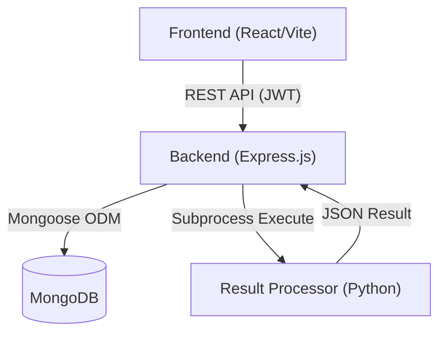

## 10. Complete End-to-End Workflow
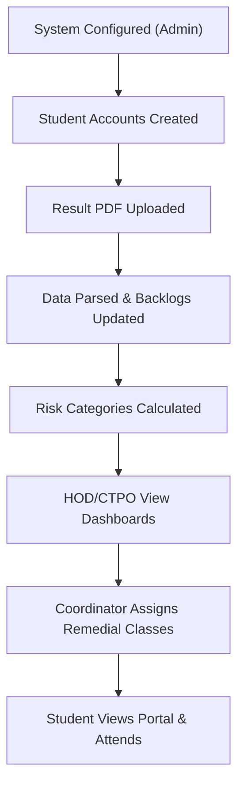

## 11. Authentication Workflow
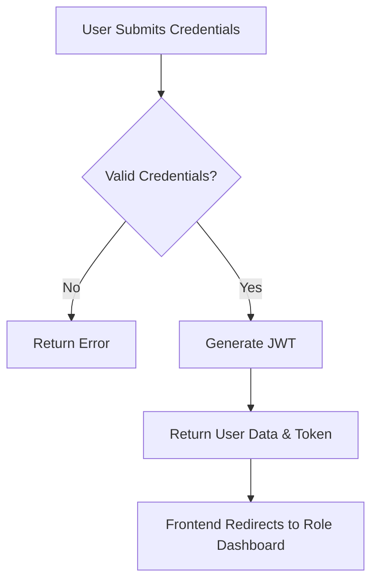

## 12. Authorization / RBAC
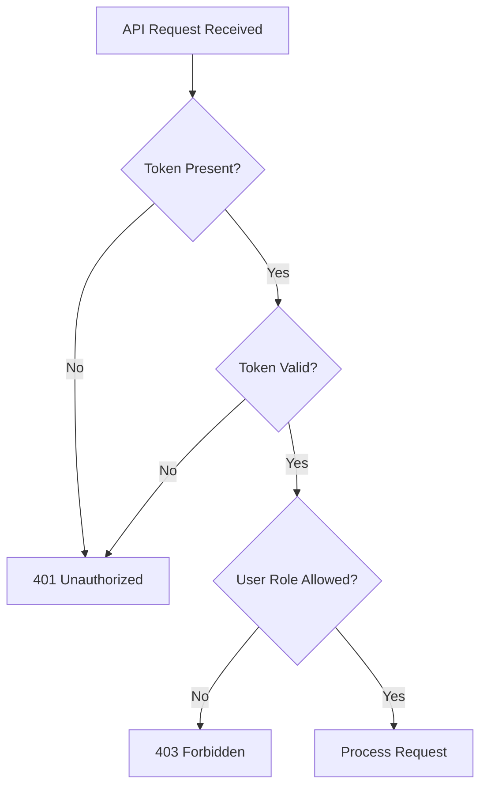

## 13. Academic Master Workflow
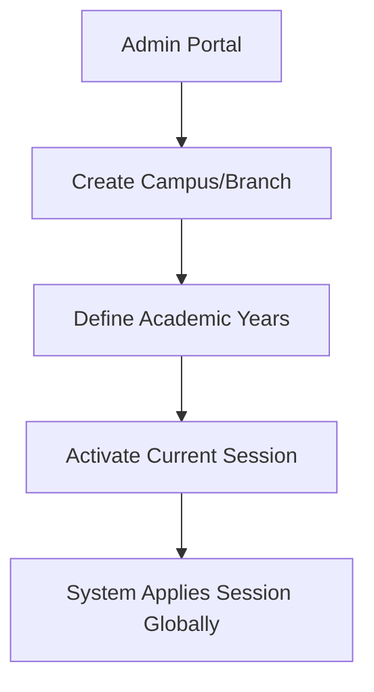

## 14. Admin Workflow
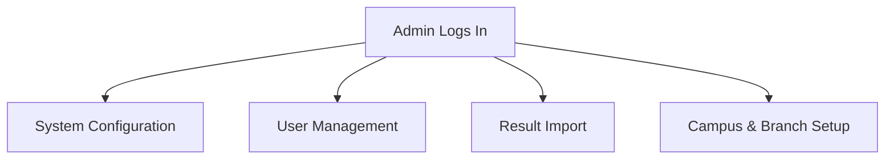

## 15. Principal Workflow
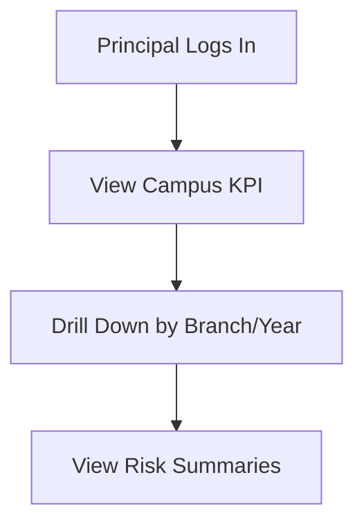

## 16. HOD Workflow
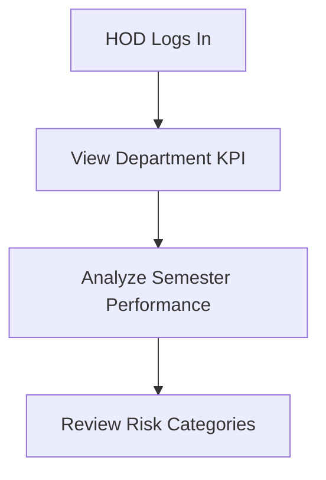

## 17. CTPO / Class Teacher Workflow
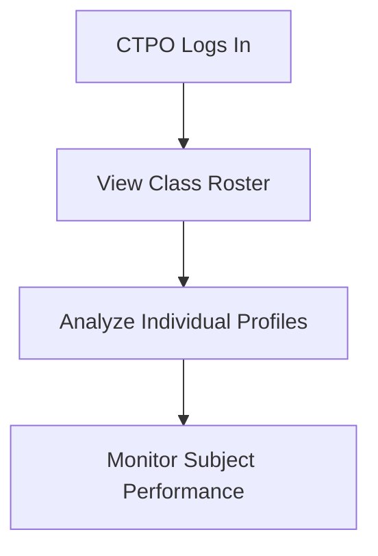

## 18. Coordinator Workflow
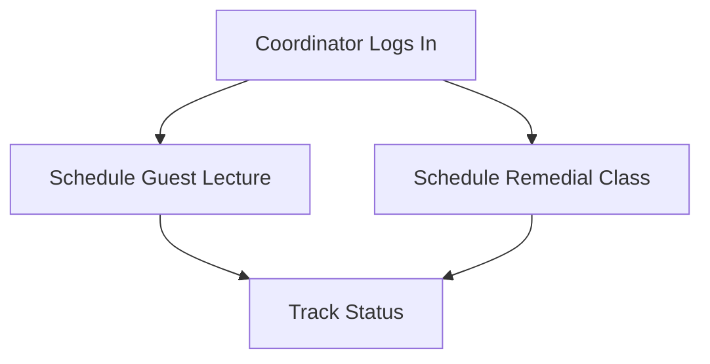

## 19. Student Workflow
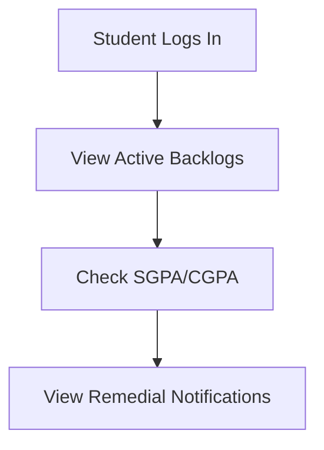

## 20. Results Workflow
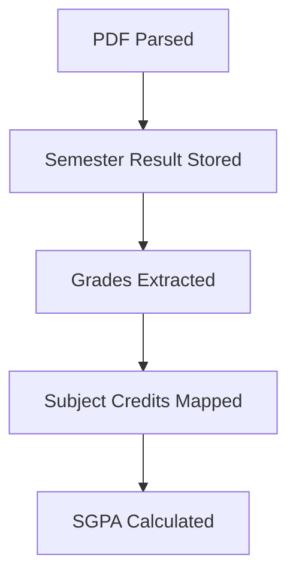

## 21. Result Import Workflow
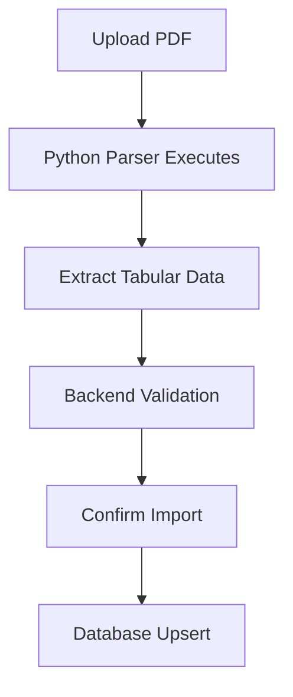

## 22. SGPA / CGPA Workflow
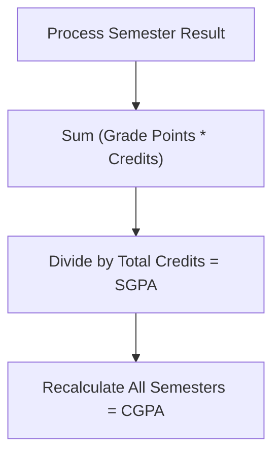

## 23. Backlog Workflow
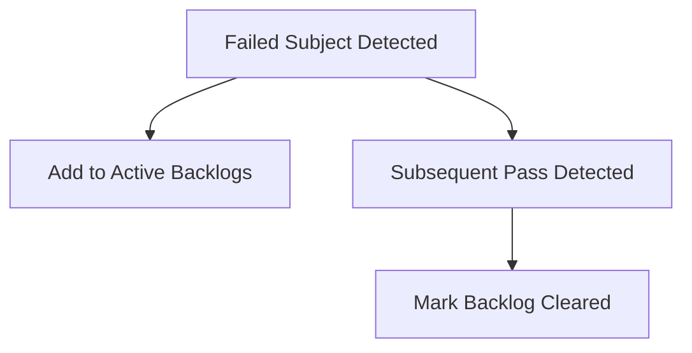

## 24. Risk Workflow
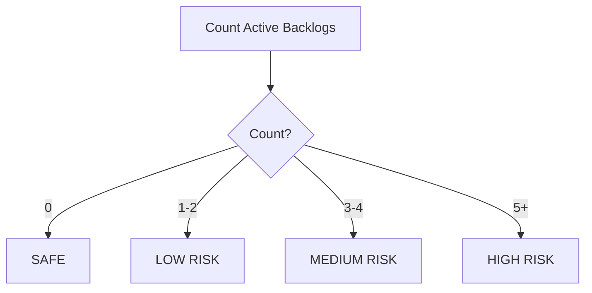

## 25. Guest Lecture Workflow
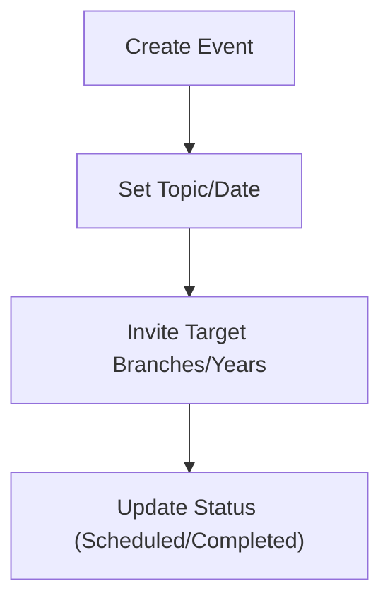

## 26. Remedial Class Workflow
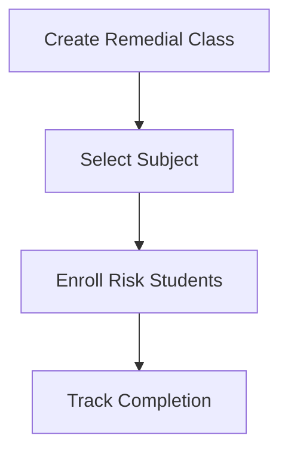

## 27. Attendance Workflow
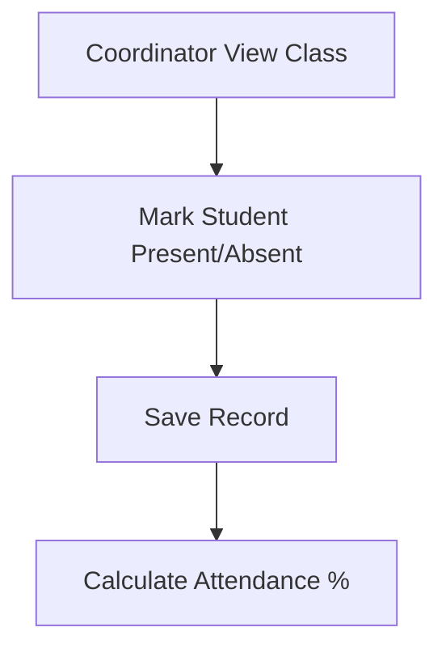

## 28. Notification Workflow
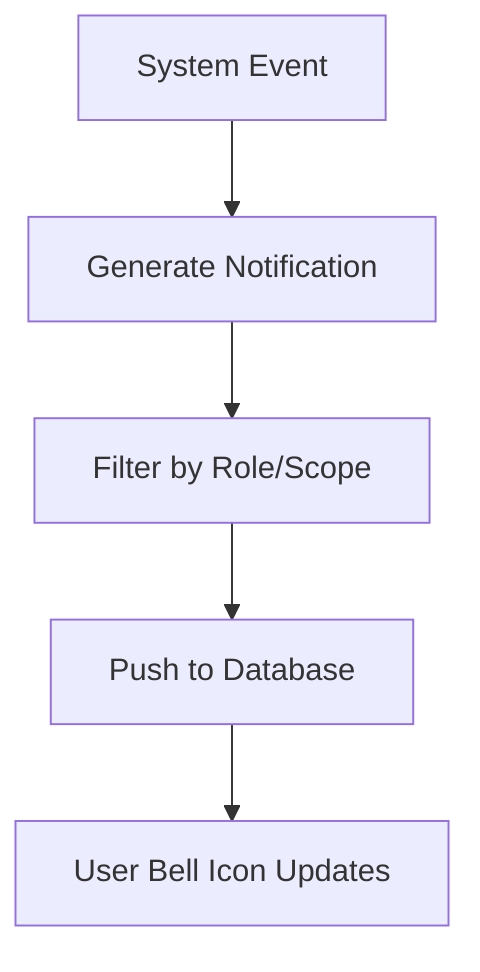

## 29. Profile Workflow
```mermaid
flowchart TD
    A["User Updates Full Name"] --> B["Save to Database"]
    B --> C["Update Auth Context"]
    C --> D["Sync Topbar/Dashboard/Hero"]
```

## 30. Avatar Workflow
```mermaid
flowchart TD
    A["Select Image"] --> B["Crop Image"]
    B --> C["Upload to GridFS"]
    C --> D["Store avatarFileId"]
    D --> E["Serve Securely"]
```

## 31. Academic Session Workflow
```mermaid
flowchart TD
    A["Admin Sets Active Year"] --> B["Database Marks ACTIVE"]
    B --> C["Other Years Marked INACTIVE"]
    C --> D["useActiveAcademicSession Hook Loads Data"]
    D --> E["Dashboards Render Current Session"]
```

## 32. Analytics Workflow
```mermaid
flowchart TD
    A["Dashboard Requested"] --> B["API Queries MongoDB"]
    B --> C["Aggregation Pipeline Executes"]
    C --> D["Return Formatted JSON"]
    D --> E["Recharts Renders Data"]
```

## 33. Database Architecture
The application runs on MongoDB, using normalized collections: Users, Campuses, Branches, Subjects, Semesters, AcademicYears, SemesterResults, Backlogs, GuestLectures, RemedialClasses, and Notifications.

## 34. API Architecture
Built on Express.js utilizing modular routers (`/auth`, `/users`, `/results`, `/analytics`, etc.). Middlewares strictly enforce authentication (`protect`) and authorization (`restrictTo`).

## 35. Frontend Architecture
React 18 + Vite utilizing component-driven architecture. State is managed via Context API (`AuthProvider`), data fetched natively, and styled via Tailwind CSS combined with shadcn/ui.

## 36. Backend Architecture
Node.js monolith handling API routing, business logic, MongoDB interactions via Mongoose, file processing (Multer), and spawning child processes for Python parsers.

## 37. Project Structure
```text
project/
├── backend/
│   ├── src/
│   ├── uploads/
│   ├── package.json
│   └── .env.example
├── frontend/
│   ├── public/
│   ├── src/
│   ├── package.json
│   └── .env.example
├── result-processor/
│   ├── pdf_parser.py
│   └── requirements.txt
├── source-data/
├── reference/
├── README.md
└── .gitignore
```

## 38. Environment Configuration
See `.env.example` in both `frontend/` and `backend/`. Ensure `MONGODB_URI`, `JWT_SECRET`, and frontend `VITE_API_BASE_URL` are set.

## 39. Local Setup
1. **Database:** Start MongoDB.
2. **Backend:** `cd backend && npm install && npm run dev`.
3. **Frontend:** `cd frontend && npm install && npm run dev`.
4. **Python Parser:** `cd result-processor && pip install -r requirements.txt`.

## 40. Testing
Run `cd backend && npm test` for Jest-based API test coverage. Run `cd frontend && npm run lint` for React code quality.

## 41. Security
- Passwords hashed with `bcrypt`.
- JWT Tokens required for API access.
- Role-based route guards in both UI and API.
- GridFS prevents direct URL access to private avatars.

## 42. Known Limitations
- OCR fallback accuracy depends heavily on the scan quality of the PDF.
- PDF Parser relies on standard JNTUK column order; severe deviations in university PDFs may require regex updates.
- Container configuration (Docker) is not currently included.

## 43. Future Scope
- Automated Email / SMS notification pipelines.
- Predictive machine learning for at-risk student intervention.
- Automated generation of printable academic transcripts.

## 44. Screenshots


