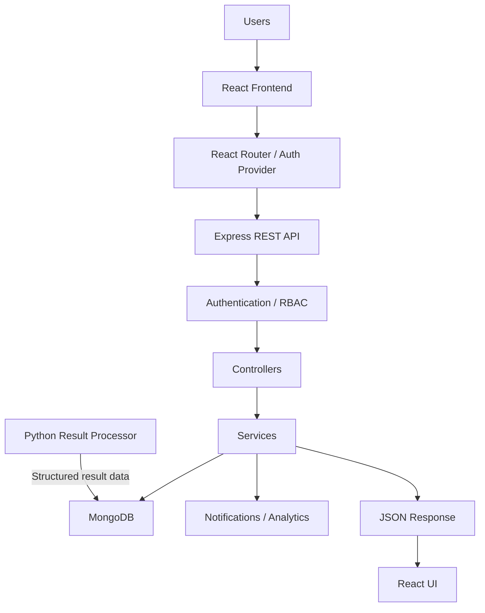
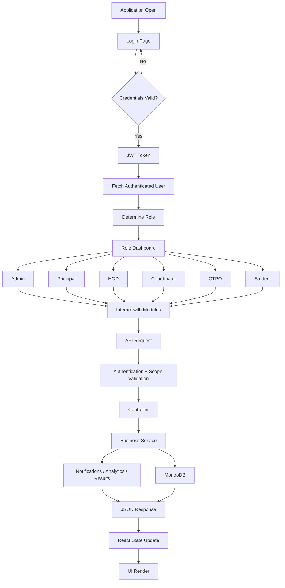
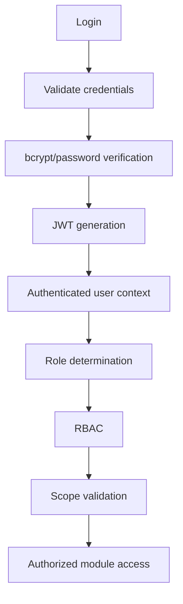
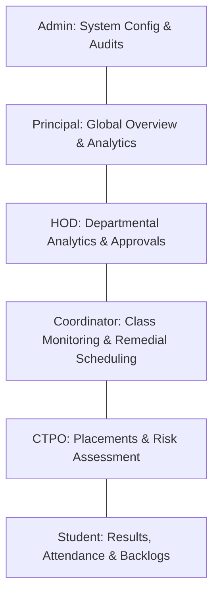
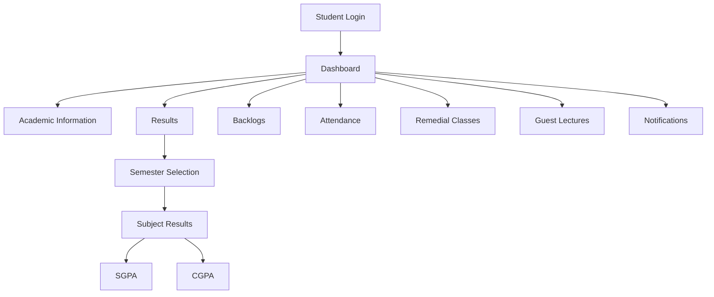
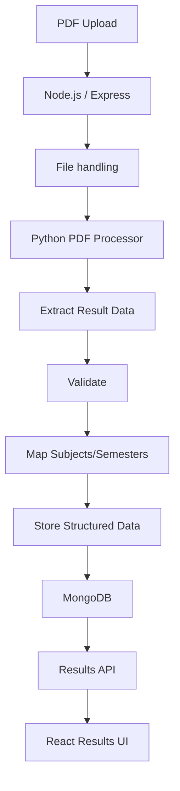
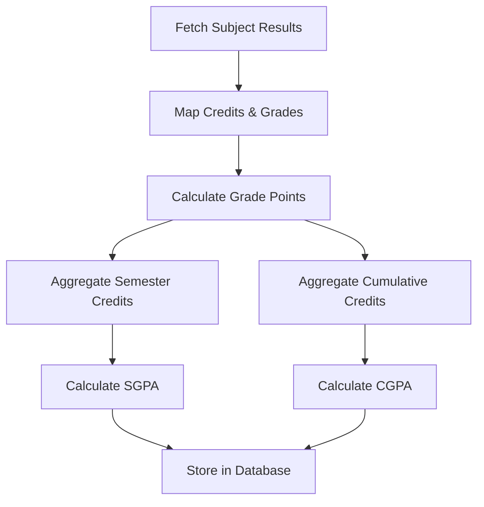
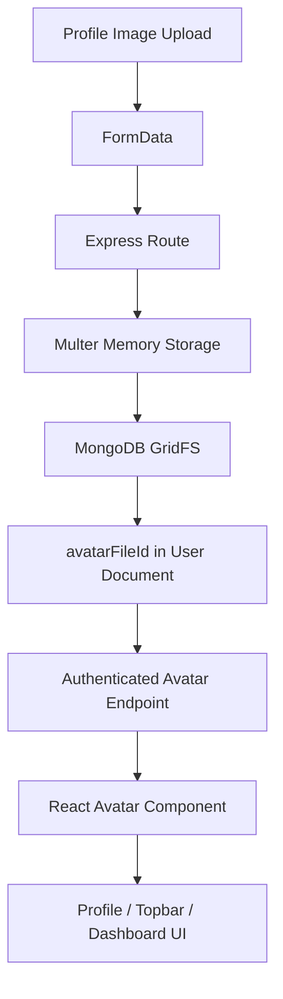
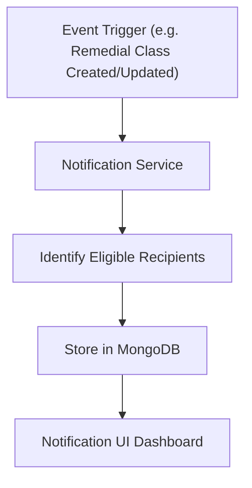
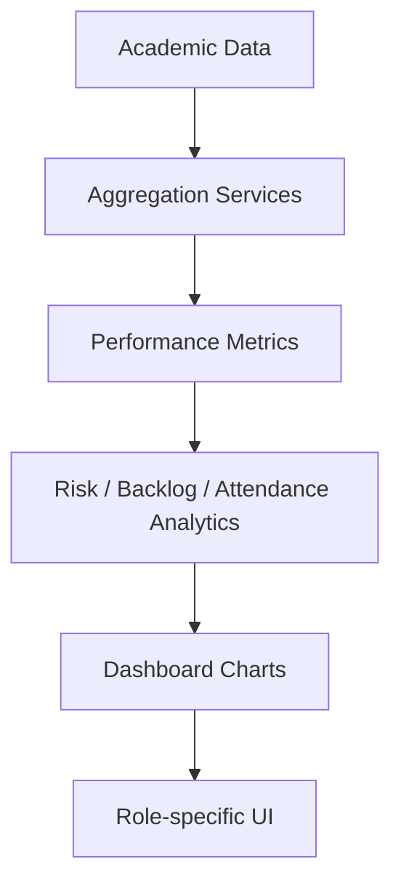

# Academic Engagement, Student Risk & Academic Support Management System

## 1. Project Overview
The Student Academic Management System is a comprehensive platform designed to streamline and centralize academic administration. It provides role-based access for students, coordinators, department heads, and administrators to effectively monitor student performance, track attendance, identify at-risk students, and coordinate academic support programs such as remedial classes and guest lectures. By consolidating fragmented academic data, the system empowers institutions to proactively support student success through actionable analytics and event-driven notifications.

## 2. Problem Statement
Educational institutions often struggle with fragmented academic data spread across disparate systems, making it difficult to maintain a holistic view of student performance. Key challenges include:
- Fragmented and delayed result management.
- Inefficient monitoring of active backlogs and attendance.
- Delayed identification of at-risk students who need immediate intervention.
- Poor communication regarding remedial support and guest lectures.
- Lack of role-specific insights for HODs, Coordinators, and CTPOs to administer academic protocols effectively.

## 3. Solution
This platform offers a robust, centralized MERN-based solution that unifies academic data management. It provides a secure, role-based ecosystem where students can access their performance metrics, while faculty and administrators receive advanced diagnostic tools to monitor risks, organize remedial support, and track overall institutional performance. Automated notifications and structured workflows ensure that critical academic interventions are communicated promptly and accurately.

## 4. Technology Stack

| Layer | Technology | Purpose |
|---|---|---|
| Frontend | React | UI |
| Frontend Language | JavaScript / JSX | Application development |
| UI | shadcn/ui | UI components |
| Styling | Tailwind CSS | Styling |
| Build Tool | Vite | Frontend build |
| Routing | React Router | Navigation |
| Charts | Recharts | Analytics visualization |
| Backend | Node.js | Runtime |
| API | Express.js | REST API |
| Backend Language | JavaScript | Server development |
| Database | MongoDB | Data storage |
| ODM | Mongoose | MongoDB access |
| File Storage | MongoDB GridFS | Persistent storage for avatars/media |
| Authentication | JWT | Authentication |
| Password Security | bcrypt | Password hashing |
| Result Processing | Python | PDF/result processing only |

## 5. Languages Used

### Application Languages
- JavaScript
- JSX

### Supporting Processing Language
- Python — used only by the result-processing pipeline for PDF extraction.

## System Architecture Flowchart



## Overall System Workflow



## Authentication / Authorization Workflow


*Security Note: The system utilizes role-based access control (RBAC) paired with scope validation to ensure strict student identity protection. Students are rigorously isolated to only their own data.*

## Role Workflow



## Student Academic Workflow



## Result Processing Workflow



## SGPA / CGPA Workflow
Academic calculations are derived from subject credits and grade points. Semesters calculate SGPA individually, while cumulative metrics track across the entire student lifecycle based on the official source of truth in the database.



## Avatar / Profile Workflow
Avatars are managed securely through MongoDB GridFS.



## Notification Workflow
The system features event-driven notifications to keep students informed of critical academic support opportunities.



## Analytics Workflow



## Project Structure
```text
project/
├── backend/               # Node.js Express backend and API logic
├── frontend/              # React/Vite JavaScript frontend application
├── result-processor/      # Python utility for PDF parsing and data extraction
├── source-data/           # Original seed and curriculum source files
├── reference/             # Project documentation and specifications
├── .gitignore
└── README.md
```
